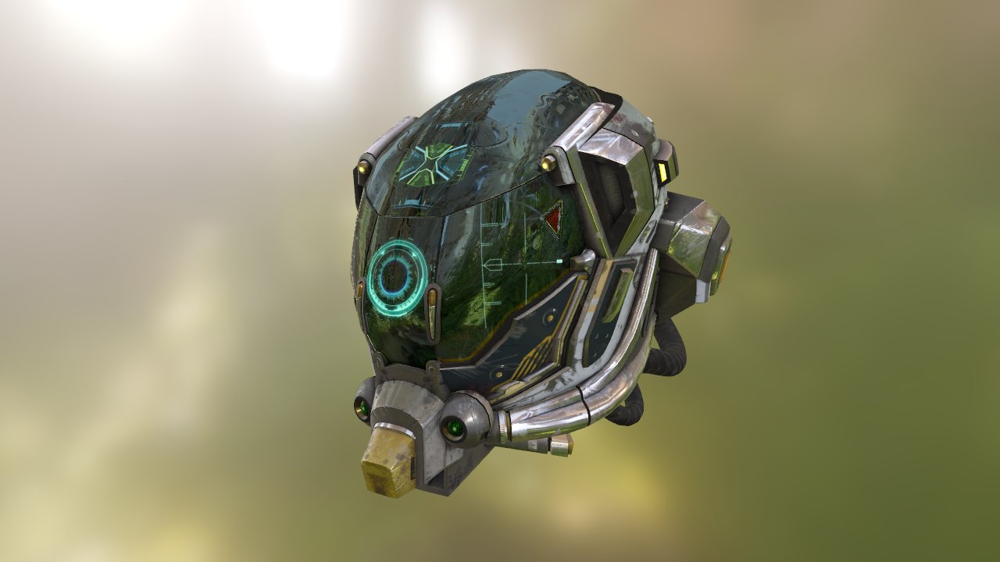
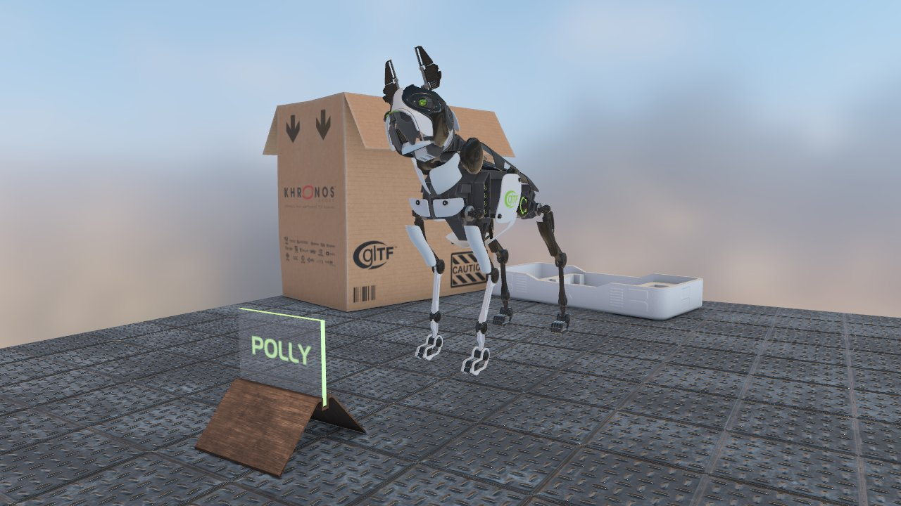
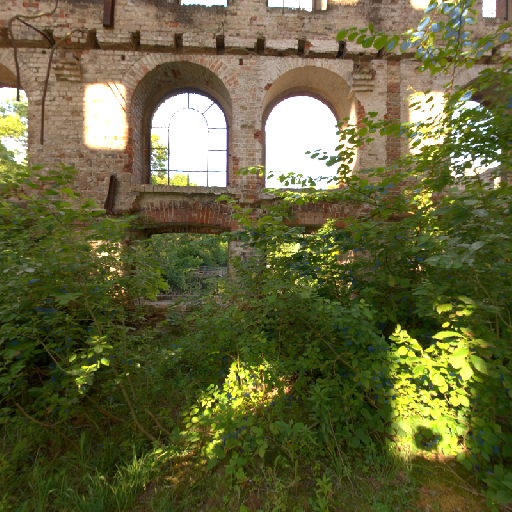
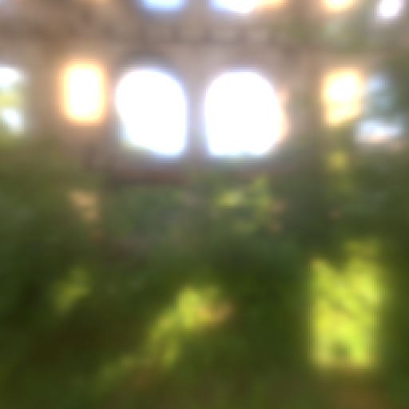
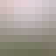
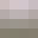

# Vulkan physically-Based Rendering using glTF 2.0 models

  

[YouTube Vulkan glTF 2.0 playlist](https://www.youtube.com/watch?v=sl7iN-vQCOs&list=PLy80eMh1-zPUz7y1JtFiS9I6H7_trBUAf)

## About

Physically-Based Rendering example implementation with image based lighting in Vulkan using glTF 2.0 models. The lighting equation is based on the [reference glTF PBR implementation](https://github.com/KhronosGroup/glTF-WebGL-PBR) from Khronos. 

## glTF 2.0 Model loading

Model loading is implemented in the [vkglTF::Model](./base/VulkanglTFModel.hpp) class, using [tiny glTF library](https://github.com/syoyo/tinygltf) to import the glTF 2.0 files, so e.g. all file formats supported by tinyglTF are suported. This class converts the glTF structures into Vulkan compatible structures used for setup and rendering.

The following major glTF 2.0 features are currently supported by the [vkglTF::Model](./base/VulkanglTFModel.hpp) class:

* [x] Loading arbitrary glTF 2.0 models
    * [x] Full node hierarchy
    * [x] Full PBR material support
        * [x] Metallic-Roughness workflow
        * [x] Specular-Glossiness workflow (extension)
    * [x] Animations   
        * [x] Articulated (translate, rotate, scale)
        * [x] Skinned
        * [ ] Morph targets
    * [x] Support for Draco mesh compression ([see instructions](#how-to-enable-draco-mesh-compression))

Note that the model loader does not fully implement all aspects of the glTF 2.0 standard, and as such there is no guarantee that all glTF 2.0 models work properly.

## Loading different scenes

The repository only includes a basic scene setup with the static "damaged helmet" pbr sample model. The official collection of glTF 2.0 sample models can be found at [here](https://github.com/KhronosGroup/glTF-Sample-Models).

To load a different scene instead, specify the glTF model file name as a command line argument, e.g.:

```
Vulkan-glTF-pbr "PATH-TO-glTF-Sample-Models\2.0\BrainStem\glTF\brainstem.gltf"
```

## Texture map generation

The physical based render model uses multiple source images for the lighting equation. Instead of relying on offline tools to generate those, this example will generate all required texture maps during startup using the GPU.

### BRDF lookup table


This pass generates a 2D BRDF lookup table based on the formulas used in the pbr implementation. The lookup table contains BRDF values for roughness and view angle and is stored as a 16-bit per component floating point texture to provide proper precision.

See ```VulkanExample::generateBRDFLUT()```

### Irradiance cube map

 

(*left*: front face environment cube map / *right*: front face irradiance cube map)

Generates a small (64 x 64 px) irradiance cube map from that stores the light radiated from the surrounding environment. This is sampled for the **indirect diffuse** part of the lighting equation.

See ```VulkanExample::generateCubemaps()``` with target ```IRRADIANCE```

### Pre-filtered (mip-mapped radiance) environment cube map

 

(*left*: front face environment cube map / *right*: front face prefiltered cube map)

Generates a pre-filtered radiance cube map that is sampled for the **indirect specular** part of the lighting equation and stores specular contribution based on roughness. The mip chain stores increasing roughness values with increasing level count and is sampled accordingly when rendering the object.

Complete mip chain from *left* roughness = 0.0 to *right* roughness = 1.0:

         

(*note:* down/up sized to same size for visualization)

See ```VulkanExample::generateCubemaps()``` with target ```PREFILTEREDENV```

## Cloning
This repository contains submodules for some of the external dependencies, so when doing a fresh clone you need to clone recursively:

```
git clone --recursive https://github.com/SaschaWillems/Vulkan-glTF-PBR.git
```

Updating submodules manually:

```
git submodule init
git submodule update
```

## Building

The repository contains everything required to compile and build the examples on **Windows**, **Linux** and **Android** using a C++ compiler that supports C++11. All required dependencies are included.

### Windows, Linux

Use the provided CMakeLists.txt with CMake to generate a build configuration for your favorite IDE or compiler, e.g.:

Windows:
```
cmake -G "Visual Studio 14 2015 Win64"
```

Linux:
```
cmake .
make
```

### Android 

#### Prerequisites

- [Android Studio 3.0](https://developer.android.com/studio/index.html) or higher
- Android [NDK](https://developer.android.com/ndk/downloads/index.html)

#### Building
- In Android Studio, select ```Import project```
- Select the ```android``` sub folder of the repository
- Once import has finished the project can be build, run and debugged from Android Studio

## How to enable Draco mesh compression
In order to enable support for loading Draco compressed glTF files you need to:
- Clone and build https://github.com/google/draco as per their [build instructions](https://github.com/google/draco#building)
- Copy the Draco decoder library ```dracodec.lib``` into ```libs\draco```
- Copy the ```src``` folder contents into ```external\draco```, make sure the ```draco_features.h``` is also present
- If everything is in place, running CMake will output ```Draco mesh compression enabled``` and loading Draco compressed meshes will work out of the box

## Links
* [glTF format specification](https://github.com/KhronosGroup/glTF)
* [glTF Sample Models](https://github.com/KhronosGroup/glTF-Sample-Models)
* [tiny glTF library](https://github.com/syoyo/tinygltf)
* [Environment maps from sIBL Archive](http://www.hdrlabs.com/sibl/archive.html)
