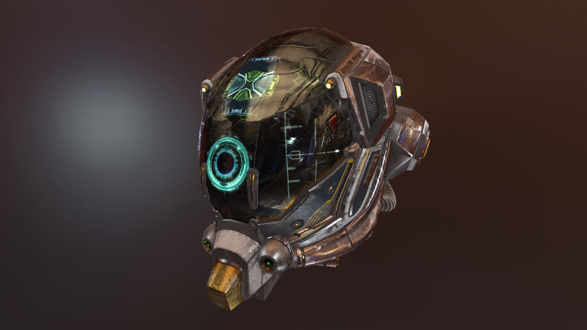

# Vulkan physical based rendering using glTF 2.0 models

## About

Physical based rendering example implementation in Vulkan using glTF 2.0 models with a meallic/roughness workflow.

## Note

**Work-in-progress, not finished yet!**

## Links
* [glTF format specification](https://github.com/KhronosGroup/glTF)
* [tiny glTF library](https://github.com/syoyo/tinygltf)
