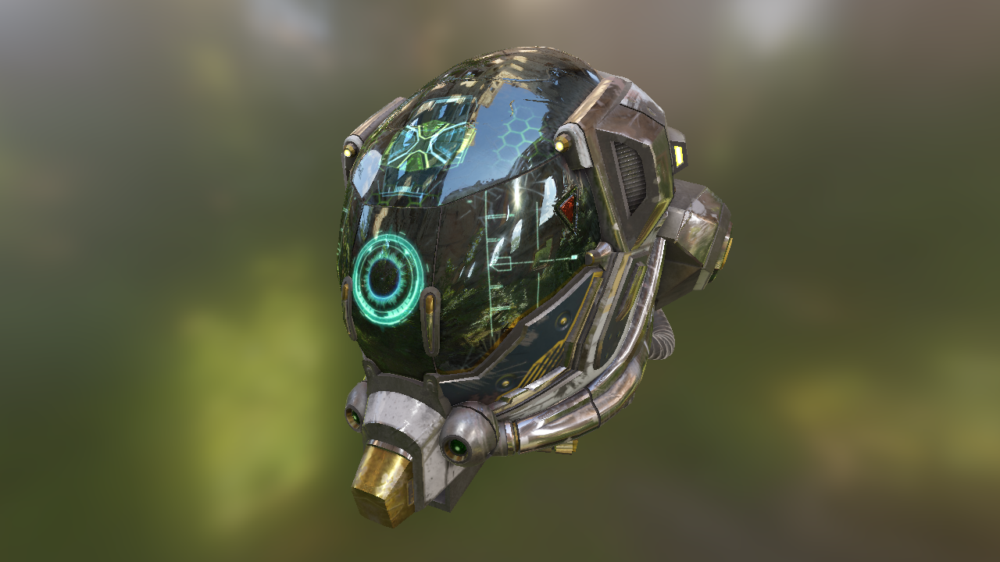

# Vulkan physical based rendering using glTF 2.0 models



## About

Physical based rendering example implementation with image based lighting in Vulkan using glTF 2.0 models with a meallic/roughness workflow.

## glTF 2.0 Model loading

Model loading and rendering is implemented in the [vkglTF::Model](./base/VulkanglTFModel.hpp) class and uses the [tiny glTF library](https://github.com/syoyo/tinygltf) to import the glTF 2.0 files. It also does texture loading from all files supported by glTF 2.0 (.png, .jpg, etc.) and generates a full mip-chain for every texture loaded. 

Note that this is not a full glTF model class implementation and as of now only supports static models, only supports a single material, etc. I plan on adding more stuff to the Vulkan glTF 2.0 loader to make it more general in the future.

## Texture map generation

The phyiscal based render model uses multiple source images for the lighting equation. Instead of relying on offline tools to generate those, this example will generate all required texture maps during startup using the GPU.

### BRDF lookup table


This pass generates a 2D BRDF lookup table based on the formulas used in the pbr implementation. The lookup table contains BRDF values for roughness and view angle and is stored as a 16-bit per component floating point texture to provide proper precision.

See ```VulkanExample::generateBRDFLUT()```

### Irradiance cube map

 

(*left*: front face environment cube map / *right*: front face irradiance cube map)

Generates a small (64 x 64 px) irradiance cube map from that stores the light radiated from the surrounding environment. This is sampled for the **indirect diffuse** part of the lighting equation.

See ```VulkanExample::generateCubemaps()``` with target ```IRRADIANCE```

### Pre-filtered (mip-mapped radiance) environment cube map

 

(*left*: front face environment cube map / *right*: front face prefiltered cube map)

Generates a pre-filtered radiance cube map that is sampled for the **indirect specular** part of the lighting equation and stores specular contribution based on roughness. The mip chain stores increasing roughness values with increasing level count and is sampled accordingly when rendering the object.

Complete mip chain from *left* roughness = 0.0 to *right* roughenss = 1.0:

         

(*note:* down/up sized to same size for visualization)

See ```VulkanExample::generateCubemaps()``` with target ```PREFILTEREDENV```

## Building

The repository contains everything required to compile and build the examples on **Windows**, **Linux** and **Android** using a C++ compiler that supports C++11. All required dependencies are included.

### Windows, Linux

Use the provided CMakeLists.txt with CMake to generate a build configuration for your favorite IDE or compiler, e.g.:

```cmake -G "Visual Studio 14 2015 Win64"```

### Android 

Building on Android is done using the [Android NDK](http://developer.android.com/tools/sdk/ndk/index.html) and requires a device that supports Vulkan. 

**Note: Android build files will be added soon**

## Links
* [glTF format specification](https://github.com/KhronosGroup/glTF)
* [tiny glTF library](https://github.com/syoyo/tinygltf)
